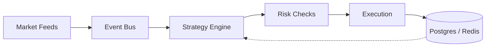

<!-- Typing header -->
<div align="center">
</div>

<div align="center">
  
</div>

<p align="center">
  <a href="https://x.com/samarkun4"></a>
  <a href="https://www.linkedin.com/in/samar-kun-6aa981358/"></a>
  <a href="mailto:samarkun4@gmail.com"></a>
  
</p>
<br>

<!-- Put your photo at assets/profile_pic.jpg -->
<p>


```
samarkun@github
-------------------------
📜 Self-taught developer
🌱 Working on quantitative finance systems across web3, web2 and AI/ML
💫 Languages: C, C++, Python, TypeScript, Rust
⚡ Building low-latency trading infra (sub-50ms)
🧠 Learning: MEV, ZK proofs, options pricing
📫 samarkun4@gmail.com
🎵 Check my musical taste below
```
</p>

<br>
<p align="center">
  
  
</p>
<!-- ═════════ PROJECTS ═════════ -->
<h2 align="center"> 🇵‌🇷‌🇴‌🇯‌🇪‌🇨‌🇹‌🇸‌ </h2>

<!-- Optional preview gif of your repos: assets/repos_preview.gif -->
<!-- <p align="center">
  
</p> -->

<!-- Replace each href below with the actual repo link, e.g. https://github.com/samarkun23/solana-trading-bot -->
<table>
  <tr>
    <!-- Web3 -->
    <td valign="top">
      <h3>⛓️ 𝗪𝗲𝗯𝟯 & 𝗗𝗲𝗙𝗶</h3>
      <ul>
        <li><a href="https://github.com/samarkun23?tab=repositories">𝐒𝐨𝐥𝐚𝐧𝐚 𝐓𝐫𝐚𝐝𝐢𝐧𝐠 𝐁𝐨𝐭</a><br>Telegram wallet, automated on-chain trading, live position management</li>
        <li><a href="https://github.com/samarkun23?tab=repositories">𝐃𝐄𝐗 𝐌𝐚𝐭𝐜𝐡𝐢𝐧𝐠 𝐄𝐧𝐠𝐢𝐧𝐞</a><br>Orderbook with real-time settlement, sub-millisecond matching</li>
      </ul>
    </td>
    <!-- Quant -->
    <td valign="top">
      <h3>📈 𝗧𝗿𝗮𝗱𝗶𝗻𝗴 & 𝗤𝘂𝗮𝗻𝘁</h3>
      <ul>
        <li><a href="https://github.com/samarkun23?tab=repositories">𝐇𝐅𝐓 𝐀𝐫𝐛𝐢𝐭𝐫𝐚𝐠𝐞 𝐁𝐨𝐭</a><br>Sub-50ms cross-DEX arbitrage, event-driven Rust</li>
        <li><a href="https://github.com/samarkun23?tab=repositories">𝐏𝐫𝐞𝐝𝐢𝐜𝐭𝐢𝐨𝐧 𝐌𝐚𝐫𝐤𝐞𝐭 𝐒𝐧𝐢𝐩𝐞𝐫</a><br>Polymarket strategies with live feeds and ML scoring</li>
      </ul>
    </td>
  </tr>
</table>

<!-- ═════════ TECH STACK ═════════ -->
<h2 align="center"> 🇹‌🇪‌🇨‌🇭‌ 🇸‌🇹‌🇦‌🇨‌🇰‌ </h2>
<p align="center">
  
  <br>
  
</p>

<!-- ═════════ SYSTEM DESIGN ═════════ -->
<h2 align="center"> 🇸‌🇾‌🇸‌🇹‌🇪‌🇲‌ 🇩‌🇪‌🇸‌🇮‌🇬‌🇳‌ </h2>

<p align="center"><sub>the general shape of my trading systems</sub></p>



|˚.🧩༘⋆ Principles .𖥔 ݁ ˖ | ✚ Building blocks ⚙️⋆.˚ |
| --- | --- |
| 🔹 Event-driven, no polling loops<br>🔹 Latency budget per stage<br>🔹 Risk checks before execution<br>🔹 Idempotent, replayable pipelines | 🔸 Rust / TypeScript services<br>🔸 WebSocket market data<br>🔸 Redis for hot state, Postgres for history<br>🔸 Solana / DEX execution layer |

<!-- ═════════ CONTACT ═════════ -->
<h2 align="center"> 🇨‌🇴‌🇳‌🇹‌🇦‌🇨‌🇹‌ 🇲‌🇪‌ </h2>
<div align="center">
  <!-- Put a second photo at assets/contact_pic.jpg -->
  
</div>
<br>

<p align="center">
  𝚏𝚎𝚎𝚕 𝚏𝚛𝚎𝚎 𝚝𝚘 𝚛𝚎𝚊𝚌𝚑 𝚘𝚞𝚝 ૮๑•̀ㅁ•́ฅა
  <br>
  𝚓𝚞𝚜𝚝 𝚙𝚘𝚔𝚎 𝚖𝚎 𝚊𝚐𝚊𝚒𝚗 𝚒𝚏 𝚒 𝚏𝚘𝚛𝚐𝚎𝚝 𝚝𝚘 𝚛𝚎𝚙𝚕𝚢 ( ´ㅁ` ; )
  <br>
  <br>
  ❀˚✿˖°❀˖°✿˖❀˖°
  <br>
</p>

<p align="center">
<a href="mailto:samarkun4@gmail.com" target="_blank">
  
</a>
<a href="https://x.com/samarkun4" target="_blank">
  
</a>
<a href="https://www.linkedin.com/in/samar-kun-6aa981358/" target="_blank">
  
</a>
</p>

<br>

<!---
Spotify stats. Replace YOUR_SPOTIFY_USER_ID with your Spotify user id
(Spotify > Profile > ... > Share > Copy link, the id is in the URL).
-->
<div align="center" style="margin-top: 40px padding-top: 40px">
  <!-- <a href="https://data-card-for-spotify.herokuapp.com/card?user_id=313dpmqqpxbxe3wewvknyrmc7y6m">
  
  </a> -->
  <a href="https://data-card-for-spotify.herokuapp.com/card?user_id=313dpmqqpxbxe3wewvknyrmc7y6m">
  
</a>

<br>
  
</div>

<p align="center"> ❀˚✿˖°❀˖°✿˖❀˖° <br> 𝚙𝚛𝚎𝚌𝚒𝚜𝚒𝚘𝚗 + 𝚜𝚙𝚎𝚎𝚍 > 𝚎𝚟𝚎𝚛𝚢𝚝𝚑𝚒𝚗𝚐 ⚡ <br> 𝚝𝚑𝚊𝚗𝚔𝚜 𝚏𝚘𝚛 𝚜𝚝𝚘𝚙𝚙𝚒𝚗𝚐 𝚋𝚢 ૮๑•̀ㅁ•́ฅა </p>

<!-- 
Generate top languages, for more info, see:
https://github.com/anuraghazra/github-readme-stats

<p align="center">
  <a href="https://github.com/anuraghazra/github-readme-stats">
    
  </a>
</p>

-
waka-readme-stats
https://github.com/anmol098/waka-readme-stats

for configuration, set .github/workflows/waka-readme.yml


-
Generate waka stats

START_SECTION:waka
END_SECTION:waka -->
